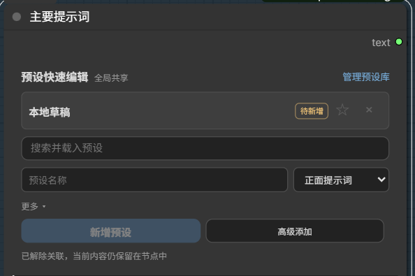
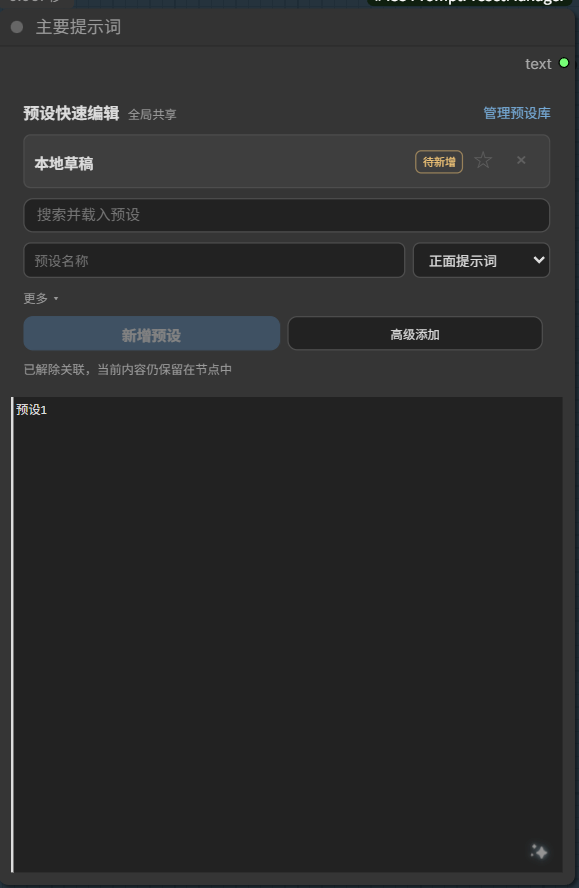
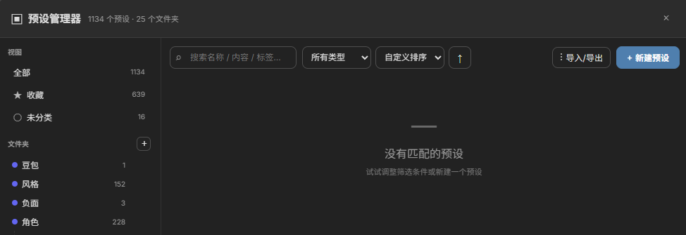

# Prompt Preset Manager

English | [简体中文](#简体中文)

A shared, searchable prompt preset library for ComfyUI. Keep reusable prompts organized without turning each workflow into a wall of text nodes.



## Features

- **Shared preset library**: presets are stored locally and are available across workflows.
- **Fast in-node editing**: search, load, edit, favorite, overwrite, or save a variant without leaving the node.
- **Full library manager**: organize presets with nested folders, types, tags, descriptions, favorites, filters, and sorting.
- **Workflow-safe drafts**: the selected preset and local edits are serialized with the node, including duplicated nodes and reopened workflows.
- **Native text output**: outputs one standard `STRING`, so it works with normal ComfyUI prompt inputs.
- **Upstream text capture**: connect any `STRING` output to the optional `text` input; non-empty results are written back into the editable prompt box after execution.
- **Import and export**: back up or move the whole library, a folder, a filtered view, or an individual preset.
- **English and Chinese UI**: follows the ComfyUI/browser locale automatically.





## Installation

### ComfyUI Manager

Search for **Prompt Preset Manager** and install it, then restart ComfyUI.

### Manual

```bash
cd ComfyUI/custom_nodes
git clone https://github.com/yurishk/ComfyUI-PromptPresetManager.git
```

Restart ComfyUI after cloning. The plugin has no third-party Python dependencies.

## Usage

1. Add **Prompt Preset Manager** from `text/presets`.
2. Open **Preset Library**, create folders and presets, or import an existing library.
3. Search and select a preset in the node.
4. Edit the native prompt box when a workflow needs a local variation.
5. Optionally connect an upstream `STRING` to the `text` input to capture and continue editing its result.
6. Connect the `text` output to any node that accepts a `STRING` prompt, or leave it unconnected and run this node as a text capture endpoint.

The shared library is stored in `data/presets.json`. Automatic backups are written to `backups/`. Both directories are local user data and are excluded from Git.

## License

[MIT](./LICENSE)

---

## 简体中文

[English](#prompt-preset-manager) | 简体中文

一个适用于 ComfyUI 的全局提示词预设管理器。它可以集中管理常用提示词，避免每个工作流都堆满重复的文本节点。


### 功能

- **全局预设库**：预设保存在本地文件中，可在不同工作流之间共享。
- **节点内快速编辑**：无需离开节点即可搜索、载入、编辑、收藏、覆盖或另存变体。
- **完整管理界面**：支持多级文件夹、类型、标签、说明、收藏、筛选与排序。
- **工作流持久化**：当前选择和本地修改会随节点保存，复制节点、切换或重新打开工作流后仍可恢复。
- **原生文本输出**：仅输出标准 `STRING`，可直接连接 ComfyUI 的普通提示词输入。
- **上游文本接收**：可将任意 `STRING` 输出连接到可选的 `text` 输入；执行后的非空结果会写回原生提示词框，方便继续修改。
- **导入与导出**：可备份或迁移整个预设库、文件夹、筛选结果或单个预设。
- **中英文界面**：根据 ComfyUI 或浏览器语言自动切换。


### 安装

#### ComfyUI Manager

搜索 **Prompt Preset Manager** 并安装，然后重启 ComfyUI。

#### 手动安装

```bash
cd ComfyUI/custom_nodes
git clone https://github.com/yurishk/ComfyUI-PromptPresetManager.git
```

克隆完成后重启 ComfyUI。本插件不需要安装额外的 Python 依赖。

### 使用方法

1. 从 `text/presets` 分类添加 **Prompt Preset Manager**。
2. 打开“预设库”，创建文件夹和预设，或导入已有预设库。
3. 在节点中搜索并选择预设。
4. 某个工作流需要单独调整时，直接编辑节点内的原生提示词文本框。
5. 如需接收提示词强化等上游结果，将其 `STRING` 输出连接到本节点的 `text` 输入。
6. 可将本节点的 `text` 输出继续连接到下游，也可以不连接，将本节点直接作为文本接收终点运行。

全局预设库保存在 `data/presets.json`，自动备份位于 `backups/`。这两个目录属于本地用户数据，不会提交到 Git。

### 许可证

[MIT](./LICENSE)
